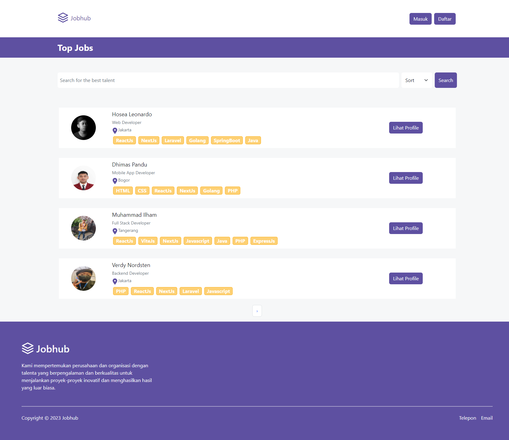
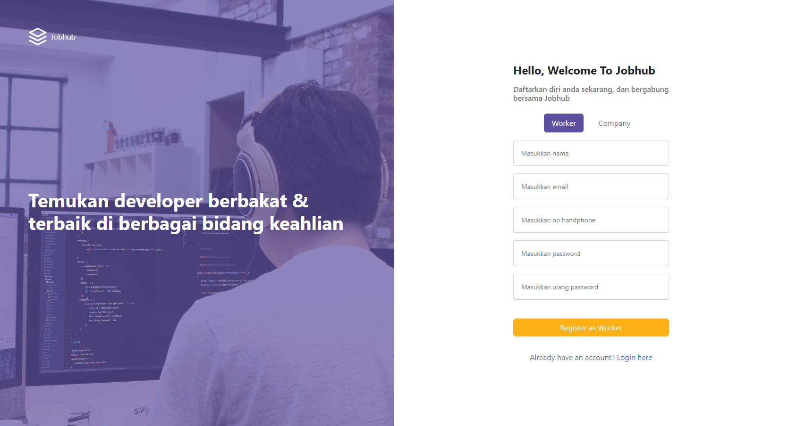
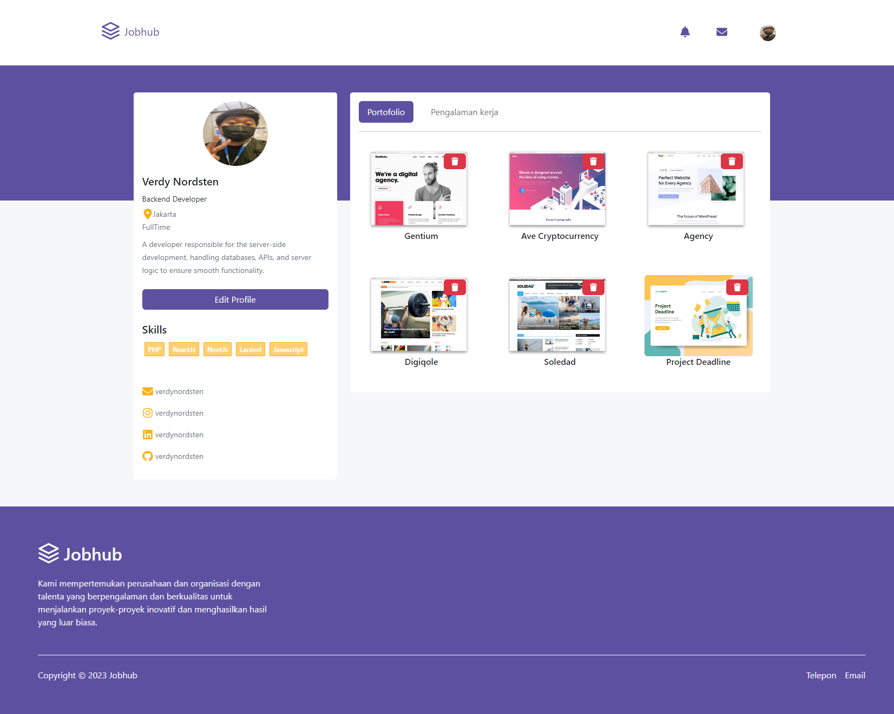
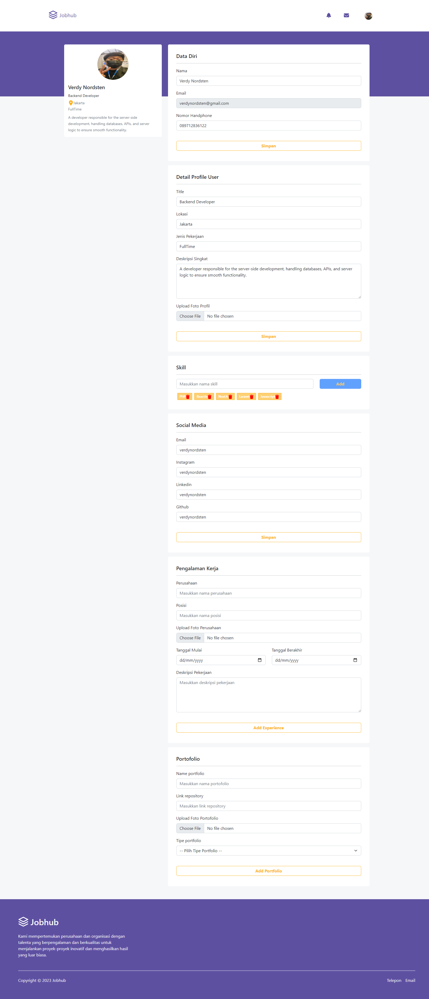
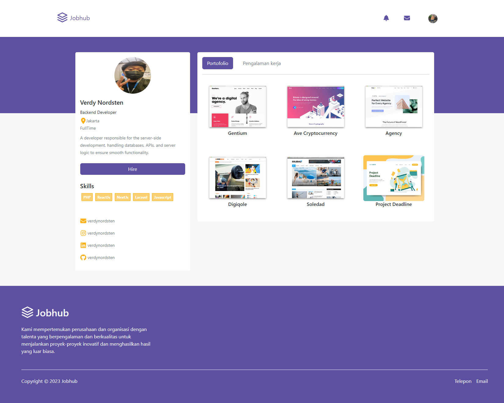

<p align="center">
<div align="center">
  
</div>
  <h3 align="center">Jobhub Frontend</h3>
  <p align="center">
    <a href="https://github.com/VerdyNordsten/jobhub_frontend"><strong>Explore the docs »</strong></a>
    <br />
    <a href="https://jobhub.digty.co.id/">View Demo</a>
    ·
    <a href="https://jobhub.up.railway.app/">Api Demo</a>
  </p>
</p>

<!-- TABLE OF CONTENTS -->

## Table of Contents

- [Table of Contents](#table-of-contents)
- [About The Project](#about-the-project)
  - [Built With](#built-with)
- [Getting Started](#getting-started)
  - [Prerequisites](#prerequisites)
  - [Requirements](#requirements)
  - [Installation](#installation)
  - [Setup .env](#setup-env)
- [Screenshots](#screenshots)
- [Related Project](#related-project)

<!-- ABOUT THE PROJECT -->

## About The Project

JobHub is an application designed for the purpose of connecting job seekers with potential employers. The platform offers a wide range of job opportunities from various industries, allowing users to search and apply for their desired positions online.

One of the standout features of JobHub is its comprehensive job listings, which include detailed information about the job requirements, responsibilities, and company profiles. This helps job seekers make informed decisions and find the perfect match for their skills and interests.

To utilize the services of JobHub, users simply need to create an account and provide their relevant job preferences and qualifications. JobHub will then display a curated list of job openings that align with the user's profile, making it convenient for them to browse and apply for suitable positions.

With JobHub, the process of finding and securing employment becomes more efficient and user-friendly, empowering both job seekers and employers in the hiring process.

<!-- GETTING STARTED -->

## Getting Started

### Prerequisites

This is an example of how to list things you need to use the software and how to install them.

- [nodejs](https://nodejs.org/en/download/)
- [Bootstrap Css](https://getbootstrap.com/)
- [Next JS](https://nextjs.org/)

| Third Party               | npm install                         |
| ------------------------- | ----------------------------------- |
| [@fortawesome/fontawesome-svg-core]     | npm i @fortawesome/fontawesome-svg-core@6.3.0     |
| [@fortawesome/free-brands-svg-icons]   | npm i @fortawesome/free-brands-svg-icons@6.3.0   |
| [@fortawesome/free-solid-svg-icons]    | npm i @fortawesome/free-solid-svg-icons@6.3.0    |
| [@fortawesome/react-fontawesome]        | npm i @fortawesome/react-fontawesome@0.2.0        |
| [axios]                   | npm i axios@1.3.4                    |
| [bootstrap]               | npm i bootstrap@5.2.3                |
| [dotenv]                  | npm i dotenv@16.0.3                   |
| [eslint]                  | npm i eslint@8.34.0                   |
| [eslint-config-next]      | npm i eslint-config-next@13.2.1        |
| [next]                    | npm i next@13.2.1                      |
| [react]                   | npm i react@18.2.0                     |
| [react-bootstrap]         | npm i react-bootstrap@2.7.2           |
| [react-dom]               | npm i react-dom@18.2.0                 |
| [react-slick]             | npm i react-slick@0.29.0               |
| [slick-carousel]          | npm i slick-carousel@1.8.1             |
| [sweetalert2]             | npm i sweetalert2@11.7.2               |

[@fortawesome/fontawesome-svg-core]: https://www.npmjs.com/package/@fortawesome/fontawesome-svg-core
[@fortawesome/free-brands-svg-icons]: https://www.npmjs.com/package/@fortawesome/free-brands-svg-icons
[@fortawesome/free-solid-svg-icons]: https://www.npmjs.com/package/@fortawesome/free-solid-svg-icons
[@fortawesome/react-fontawesome]: https://www.npmjs.com/package/@fortawesome/react-fontawesome
[axios]: https://www.npmjs.com/package/axios
[bootstrap]: https://www.npmjs.com/package/bootstrap
[dotenv]: https://www.npmjs.com/package/dotenv
[eslint]: https://www.npmjs.com/package/eslint
[eslint-config-next]: https://www.npmjs.com/package/eslint-config-next
[next]: https://www.npmjs.com/package/next
[react]: https://www.npmjs.com/package/react
[react-bootstrap]: https://www.npmjs.com/package/react-bootstrap
[react-dom]: https://www.npmjs.com/package/react-dom
[react-slick]: https://www.npmjs.com/package/react-slick
[slick-carousel]: https://www.npmjs.com/package/slick-carousel
[sweetalert2]: https://www.npmjs.com/package/sweetalert2

### Installation

- Clone This Front End Repo

```
git clone https://github.com/VerdyNordsten/jobhub_frontend
```

- Go To Folder Repo

```
cd jobhub_frontend
```

- Install Module

```
npm install
```

- <a href="#setup-env">Setup .env</a>
- Type ` npm run dev` To Start Website
- Type ` npm run production` To Start Production

### Setup .env

Create .env file in your root project folder.

```
NEXT_PUBLIC_API_URL = [BACKEND_URL]
```

<!-- ROADMAP -->

## Screenshots

<table>
<div align="center">
  <tr>
    <td></td>
  </tr>
  <tr>
    <td>Home Page</td>
  </tr>
  <tr>
    <td> </td>
  </tr>
  <tr>
    <td>Talent List</td>
  </tr>
  <tr>
    <td> </td>
  </tr>
  <tr>
    <td>Login</td>
  </tr>
  <tr>
    <td> </td>
  </tr>
  <tr>
    <td>Register</td>
  </tr>
  <tr>
    <td> </td>
  </tr>
  <tr>
    <td>My Profile</td>
  </tr>
  <tr>
    <td> </td>
  </tr>
  <tr>
    <td>Edit Profile</td>
  </tr>
  <tr>
    <td> </td>
  </tr>
  <tr>
    <td>Profile User</td>
  </tr>
</div>
</table>

## Related Project

:rocket: [`Backend Jobhub`](https://github.com/VerdyNordsten/jobhub_backend)

:rocket: [`Frontend Jobhub`](https://github.com/VerdyNordsten/jobhub_frontend)

:rocket: [`Demo Jobhub`](https://jobhub.digty.co.id/)

Project Link: [https://github.com/VerdyNordsten/jobhub_frontend](https://github.com/VerdyNordsten/jobhub_frontend)